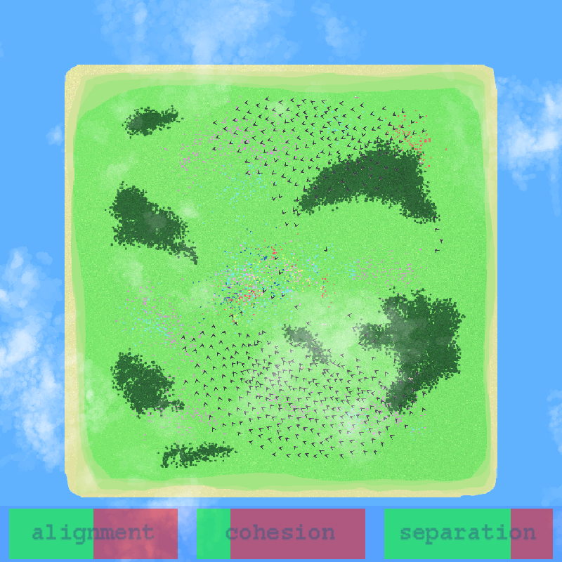

# Boids in OpenGL

A simple 2D Boids demo using OpenGL.

## Team members

- [Păcurariu Răzvan Mihai](https://github.com/razvanpacku)
- [Luparu Ioan Teodor](https://github.com/BrainDBD)

## University documentation
[Here](docs/Documentation.pdf)

## Overview

This demo implements a 2D boids simulation, with the inclusion of nests that the boids get attracted to. There are zoom controls and tracking controls for tracking either a boid (with `t`) or a nest (with `y`). There are also 3 slider controls that control parameters of the simulation, controlled with `[`, `]`, `;`, `'`, `,`, and `.`. There are also clouds that pan from left to right at different speeds.

## Images



## Build & run

### Prerequisites

- Windows with Visual Studio (MSVC) or MSBuild.
- GPU/drivers supporting OpenGL. (Project includes GLAD/GLFW/GLM headers in the repo.)

### Building

- Recommended: open the solution in Visual Studio
    1. Open [Project.sln](Project.sln) in Visual Studio.
    2. Select Platform = x64 (if needed) and Configuration = Debug or Release.
    3. Build -> Build Solution.
- Command line (MSBuild)
```sh
msbuild Project.sln /p:Configuration=Release /p:Platform=x64
```

### Run

- From Visual Studio: Start Debugging / Start Without Debugging
- From command line: run the built executable (example paths below — adjust for Debug/Release)
```sh
cd x64/Release
Project.exe
```